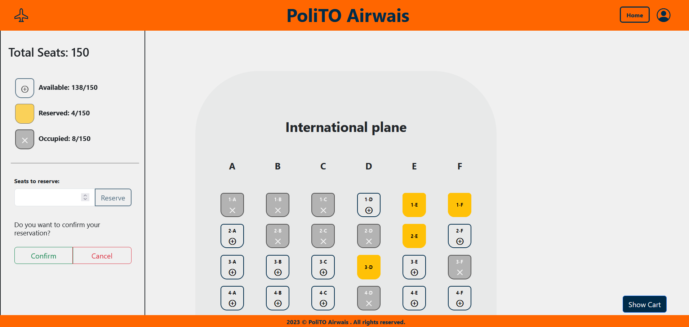
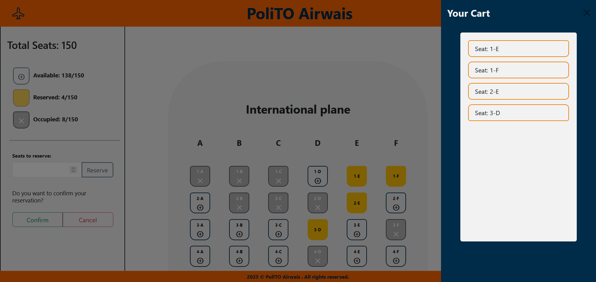

# Exam #2: "Airplane Seats"
## Student: s316993 Nicolò Caradonna 

# **React Client Application Routes**

- **Route** `/`: Homepage of the application, contains three selectable Cards corresponding to the airplanes types.

- **Route** `/login`: Application login page, contains a form to allow a registered user to authenticate into the application

- **Route** `/local_plane` : Booking page for a "Local" type airplane in the application. Seat availability is shown for non-authenticated users, while authenticated users can also select and reserve up to 60 seats.

- **Route** `/regional_plane` : Booking page for a "Regional" type airplane in the application. Seat availability is shown for non-authenticated users, while authenticated users can also select and reserve up to 100 seats.

- **Route** `/international_plane` : Booking page for a "International" type airplane in the application. Seat availability is shown for non-authenticated users, while authenticated users can also select and reserve up to 150 seats.

- **Route** `*`: not found page

# **API Server**

## User management
 GET `/api/sessions/current`
* Request parameter: _none_
* Request body: _none_
* Description:  check if current user is logged in and get her data
* Response Body: authenticated user
 
POST `/api/sessions`
- Request parameter: _none_
- Request body: credentials of the user who is trying to login
- Description:  authenticate the user who is trying to login
- Response Body: authenticated user

DELETE `/api/sessions/current`
- Request parameter: _none_
- Request body: _none_
- Response Body: _none_
- Description:   logout current user

# Plane management
 GET `/api/plane_seats/`
- Request parameter: `plane_id`
- Request body: _none_
- Response Body: list of object as rapresented in the database table *seats*
- Description: returns all the seats for a given plane id

GET `/api/plane_info`
- Request parameter: _none_
- Request body: _none_
- Response Body: list of object as rapresented in the database table plane
- Description: returns all the planes with their informations in the database

GET `/api/check/`
- Request parameter: `seat_id`
- Request Body: _none_
- Response Body: an object containing a cod_user
- Description: returns the id of the user who booked the seat corresponding to the seat_id

PUT `/api/reserve`
- Request parameter: _none_
- Request Body: `seat_id`
- Response Body: an empty object
- Description: the seat corresponding to the seat_id is updated with the user_id of the user that performed the reservation on that seat

DELETE `/api/delete`
- Request parameter: _none_
- Request Body: `plane_id`
- Response Body: an empty object
- Description: given the user_id and the plane_type delete all the reserved seats associated to the user

# **Database Tables**

- Table `users` - contains users credentials (email, hashed password and salt)

- Table `planes` - contains planes information (plane type, number of rows, number of seats per row and total number of seats)

- Table `plane_seats` - contains seats information (row number, line letter, plane type and id of the user who booked the seat)

# **Main React Components**

- `Home` (in `Home.jsx`): shows the main layout of the homepage

- `PlaneBox` (in `Home.jsx`): render a box related to a one of the available planes and redirects to the corresponding routes

- `LoginPage` (in `login.jsx`): shows a box to perform login in the app

- `Seats` (in `Seats.jsx`): shows the seats grid for the selected plane

- `Sidebar` (in `Sidebar.jsx`): shows right-end sidebar containing the legend of seats status and some interactive components

- `BookingComponents` (in `BookingComponents.jsx`): shows a box where users can select manually the number of seats to reserve and  "**confirm**" or "**cancel**"  reservation

- `DeleteBox` (in `Sidebar.jsx`): shows a box where users can "**delete**" a booking

- `Counters` (in `Counters.jsx`): shows the number of available, reserved, occupied seats

- `Seatscart` (in `Seatscart.jsx`): shows an offcanvas react component containing the list of reserved seats

# **Screenshot**

# **Users Credentials**

-Here you can find a list of the users already registered inside the provided database.

|               email           | plain-text password |
|-------------------------------|---------------------|
| giovanni.bianchi@polito.it    | password            |
| mario.rossi@polito.it         | password            |
| maria.verdi@polito.it         | password            |
| nicolo.caradonna@polito.it    | password            |

# **How to run**
- Install node.js and nodemon (globally)
- npm install in "Client"
- npm install in "Server"
- npm run dev in "Client"
- nodemon index.js in "Server"
